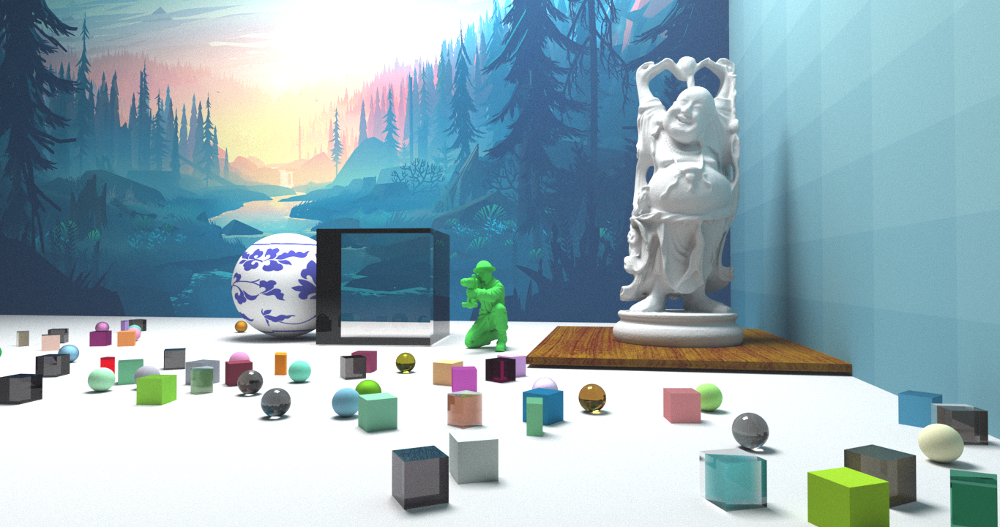
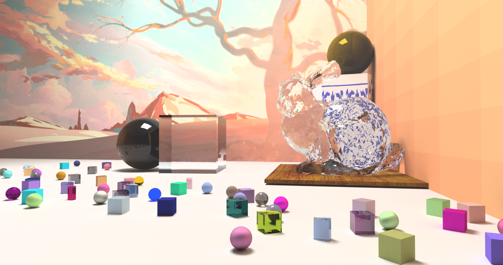
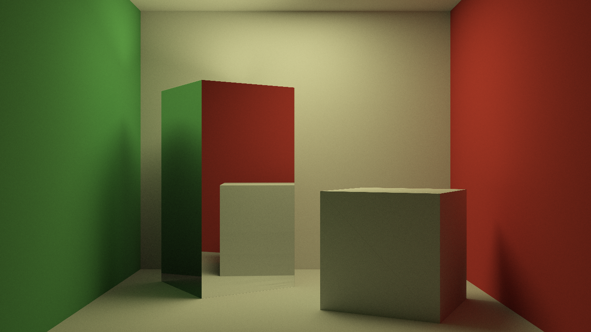
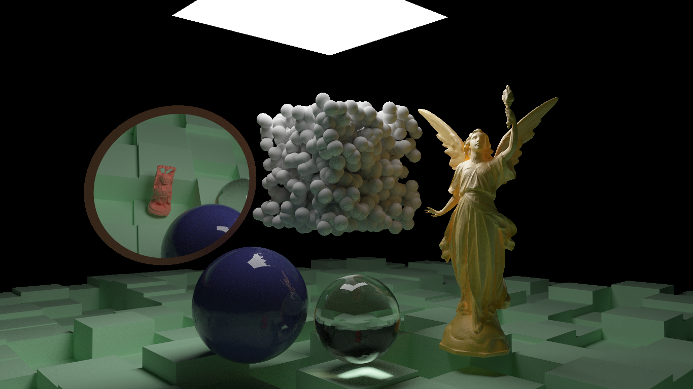
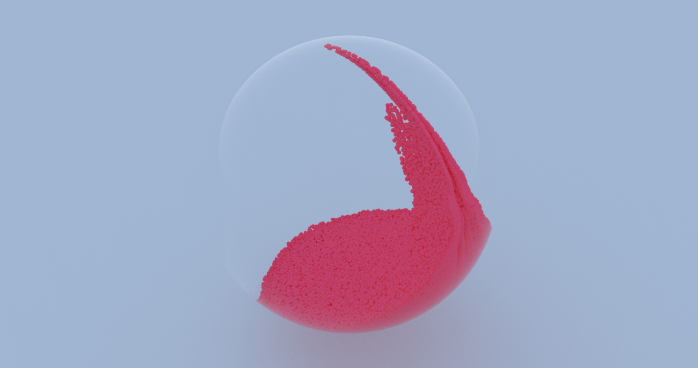

# Toy Tracer

This is my toy Path Tracer, it is not very efficient but it gets the job done.
It does not perform any smart sampling (yet), it simply brute forces rays to get the final image
but it is not very slow, runs on CUDA using a BVH structure for speed-up. Here are some images
I generated using it:

* It supports mesh, but I'm still working on instancing;

* Obligatory Cornell box scene with a sphere to test caustics;

* I followed the style of the mini-books from Peter Shirley

* This is also being used in my other works with SPH simulations for better image.

