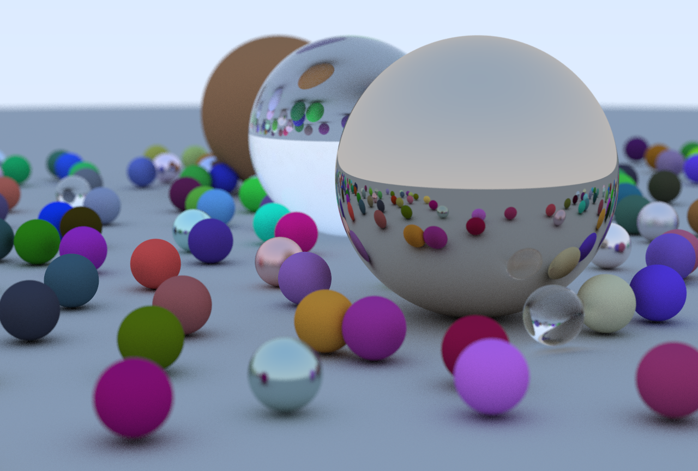
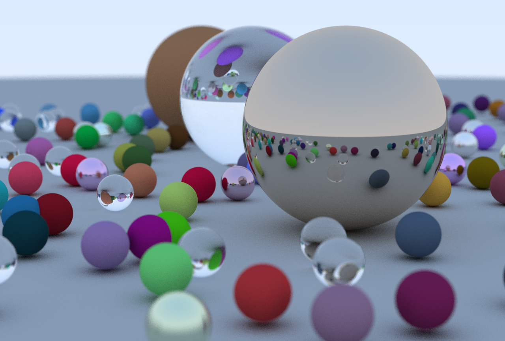

# PathTracer
Path Tracer based on the mini-book series written by Peter Shirley

This repo contains 2 implementations, CPU/GPU version (C/C++ , Cuda C).

The images bellow (1280x864) were rendered using my (very slow) notebook:

Intel i5-5200U @2.20GHz,
8.0GB RAM,
Geforce 920M 2GB - Compute Capability 3.5

Image rendered using the CPU version - 120 samples per pixel ( 5 hours 20 minutes and 45 seconds )

Image rendered using the GPU version - 150 samples per pixel ( 55 minutes and 24 seconds )

*GPU version uses cudaMallocManaged and recursion on __device__ function. Be sure your GPU supports that if you wish to build the program.

**I was feeling really lazy so I didn't proper do a batch system for the GPU version, so you will need to run with at least 20 samples per pixel. Use only multiple of 10 that are bigger than 10.

***Since I made this on Windows, I use a implementation of drand48 I found somewhere on github (can't remenber where... sorry!)
